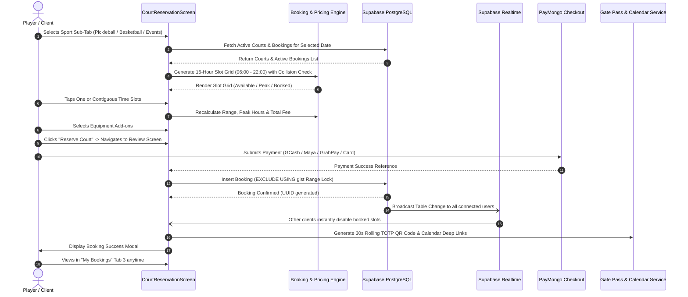

# 🏟️ Comprehensive Booking System & Multi-Resource Reservation Guide

This technical guide details the complete architecture, data models, slot algorithms, conflict detection engine, dynamic pricing formulas, and end-to-end booking lifecycle implemented in the application.

---

## 📑 Table of Contents
1. [Executive Summary & Multi-Resource Domain](#1-executive-summary--multi-resource-domain)
2. [End-to-End Booking Lifecycle: How It Works](#2-end-to-end-booking-lifecycle-how-it-works)
3. [Data Models & PostgreSQL Schema](#3-data-models--postgresql-schema)
4. [Time Slot Grid & Multi-Selection Engine](#4-time-slot-grid--multi-selection-engine)
5. [Availability & Conflict Detection Algorithm](#5-availability--conflict-detection-algorithm)
6. [Dynamic Pricing Engine (Peak, Off-Peak & Equipment Add-ons)](#6-dynamic-pricing-engine-peak-off-peak--equipment-add-ons)
7. [Concurrency, Atomic Locks & Realtime Pub/Sub](#7-concurrency-atomic-locks--realtime-pubsub)
8. [Post-Checkout Fulfillment: Gate Pass, Receipts & Calendar Deep Links](#8-post-checkout-fulfillment-gate-pass-receipts--calendar-deep-links)
9. [Navigation Hierarchy & UI/UX Architecture](#9-navigation-hierarchy--uiux-architecture)
10. [Cancellation & Refund Rules (24-Hour Policy)](#10-cancellation--refund-rules-24-hour-policy)
11. [Portable Implementation Boilerplate](#11-portable-implementation-boilerplate)

---

## 1. Executive Summary & Multi-Resource Domain

The reservation engine powers three distinct sports and hospitality disciplines within a single high-performance system:

1. **Pickleball Courts (Courts 1–4):**
   - Regulation indoor cushioned acrylic, premium outdoor, and championship stadium configurations.
   - Standard rates: ₱300.00/hr (off-peak) / ₱350.00/hr (peak).
   - Sport-specific equipment rentals: Carbon fiber pro paddles (₱150 flat) and programmable spin ball machines (₱150/hr).
2. **Basketball Half-Courts (Hoops 1 & Hoops 2):**
   - High-impact indoor polyurethane and FIBA-spec shock-absorbent hardwood half courts designed for 3v3 training, shootouts, and team scrimmages.
   - Standard rates: ₱400.00/hr (off-peak) / ₱500.00/hr (peak).
   - Sport-specific equipment rentals: Official game basketballs (₱100 flat) and digital scoreboard & shot clock remote (₱150/hr).
3. **Events Place & Pavilions (Grand Pavilion & Glasshouse):**
   - Full venue reservations for tournaments, corporate leagues, and exhibitions with guest count selection, dedicated event date ranges, and AV/catering integration.

```
                      +---------------------------------------+
                      |       MAIN NAVIGATION (4 TABS)        |
                      +---------------------------------------+
                      | 1. Arena (Hero Action Carousel)       |
                      | 2. Reservation (3-Segment Selector)   |
                      | 3. My Bookings (Active, Upcoming, QR) |
                      | 4. Profile (DUPR, Tier, Theme)        |
                      +-------------------+-------------------+
                                          |
                                 [Tab 2: Reservation]
                                          |
        +---------------------------------+---------------------------------+
        |                                 |                                 |
[Pickleball Courts]             [Basketball Half Courts]              [Events Place]
- Courts 1 to 4                 - Hoops 1 & 2 (Half Court)            - Grand Pavilion
- Cushioned / Indoor / Outdoor  - Polyurethane / FIBA Spec            - Glasshouse Hall
- Paddle / Ball Machine Add-ons - Ball / Shot Clock Add-ons           - Full Day / Half Day
```

---

## 2. End-to-End Booking Lifecycle: How It Works

The booking journey is an atomic, step-by-step pipeline designed for zero-jank execution, strict inventory isolation, and instant post-booking fulfillment:



### Detailed Step-by-Step Flow

#### Step 1: Sport Category Discovery
- In the **Reservation Screen** (`lib/screens/booking/court_reservation.dart`), users select one of three top sub-tabs:
  - **Pickleball** (Index 0)
  - **Basketball (Half Court)** (Index 1)
  - **Events Place** (Index 2)
- Switching tabs updates the court list dynamically while preserving selected dates.

#### Step 2: Date & Court Selection
- Users browse horizontal court cards displaying surface type, lighting amenities, hourly rates, and venue location.
- Changing the calendar date triggers a query to fetch all confirmed reservations for that resource on that calendar day.

#### Step 3: Interactive Time Slot Grid
- Operating hours span **06:00 to 22:00 (16 discrete 1-hour blocks)**.
- The engine checks three conditions for every block:
  1. Past hour constraint (if viewing today, expired hours are disabled).
  2. Operating boundary ($hour + 1 \le 22$).
  3. Collision check against active database records using half-open intervals $[start, end)$.
- Users can select a single slot or multi-select contiguous blocks.

#### Step 4: Equipment & Sport Add-ons
- Add-on options adapt based on active sport:
  - **Pickleball**: Carbon fiber paddles (+₱150 flat) and ball thrower machine (+₱150/hr).
  - **Basketball**: Official game basketballs (+₱100 flat) and digital scoreboard/shot clock remote (+₱150/hr).

#### Step 5: Live Pricing Computation
- Total cost formula:
  $$\text{Total} = \sum_{s \in \text{Slots}} \text{Rate}(s) + \text{Flat Addons} + (\text{Hourly Addons} \times \text{Duration})$$
- Peak hour surcharge is automatically factored in for any slot falling between 17:00 and 22:00.

#### Step 6: Review & PayMongo Multi-Channel Checkout
- In `BookingReviewScreen`, player contact details are validated under NIST SP 800-63B standards.
- Payment is processed via **PayMongo** supporting GCash, Maya, GrabPay, and major Credit/Debit cards (with resilient offline sandbox simulation).

#### Step 7: Atomic Insertion & Double-Booking Defense
- Insertion query executes with PostgreSQL `btree_gist` exclusion constraints. If two users attempt to book the exact same court and time simultaneously, PostgreSQL rejects the second transaction cleanly.
- Supabase Realtime channel broadcasts the update to all connected clients, disabling the slot across all devices without a page reload.

#### Step 8: Fulfillment & Gate Pass
- The user receives an instant confirmation dialog with:
  - **1-Tap RFC 5545 Calendar Sync** (Google Calendar, Apple Calendar, Microsoft Outlook, `.ics`).
  - **Downloadable Itemized Receipt** with PDF/image share sheet.
  - **Dynamic Laser-Sweep QR Code Gate Pass** generated via rolling 30-second TOTP tokens for kiosk turnstile access.
- All reservations appear in **Tab 3 ("My Bookings")** under Upcoming or Past tabs.

---

## 3. Data Models & PostgreSQL Schema

### Production Database Schema (`referenceonly/Project.sql`)

```sql
-- Enable btree_gist extension for timestamp exclusion
CREATE EXTENSION IF NOT EXISTS btree_gist;

-- Venues Table
CREATE TABLE IF NOT EXISTS public.venues (
    id UUID PRIMARY KEY DEFAULT gen_random_uuid(),
    name VARCHAR(150) NOT NULL,
    address TEXT NOT NULL,
    city VARCHAR(100) NOT NULL,
    operating_hours VARCHAR(50) DEFAULT '06:00 - 22:00',
    created_at TIMESTAMPTZ DEFAULT NOW()
);

-- Courts & Sports Resources Table
CREATE TABLE IF NOT EXISTS public.courts (
    id UUID PRIMARY KEY DEFAULT gen_random_uuid(),
    venue_id UUID NOT NULL REFERENCES public.venues(id) ON DELETE CASCADE,
    name VARCHAR(100) NOT NULL,
    type VARCHAR(50) DEFAULT 'indoor', -- 'indoor' | 'outdoor' | 'cushioned acrylic' | 'polyurethane' | 'fiba'
    sport VARCHAR(50) DEFAULT 'pickleball', -- 'pickleball' | 'basketball'
    hourly_rate NUMERIC(10,2) NOT NULL DEFAULT 300.00,
    peak_hourly_rate NUMERIC(10,2) NOT NULL DEFAULT 350.00,
    is_active BOOLEAN DEFAULT TRUE,
    created_at TIMESTAMPTZ DEFAULT NOW()
);

-- Bookings & Reservations Table
CREATE TABLE IF NOT EXISTS public.bookings (
    id UUID PRIMARY KEY DEFAULT gen_random_uuid(),
    court_id UUID NOT NULL REFERENCES public.courts(id) ON DELETE CASCADE,
    user_id UUID NOT NULL,
    start_time TIMESTAMPTZ NOT NULL,
    end_time TIMESTAMPTZ NOT NULL,
    duration_hours NUMERIC(4,2) NOT NULL,
    total_amount NUMERIC(10,2) NOT NULL,
    status VARCHAR(30) NOT NULL DEFAULT 'confirmed', -- 'confirmed' | 'pending' | 'cancelled'
    paddle_rental BOOLEAN DEFAULT FALSE,
    ball_thrower_rental BOOLEAN DEFAULT FALSE,
    basketball_rental BOOLEAN DEFAULT FALSE,
    scoreboard_rental BOOLEAN DEFAULT FALSE,
    guest_email VARCHAR(255),
    payment_reference VARCHAR(100),
    created_at TIMESTAMPTZ DEFAULT NOW(),
    
    -- Validation: start strictly precedes end
    CONSTRAINT check_booking_times CHECK (start_time < end_time),
    
    -- Zero Double-Booking Guarantee via GiST Range Exclusion
    CONSTRAINT exclude_overlapping_bookings EXCLUDE USING gist (
        court_id WITH =,
        tsrange(start_time, end_time, '[)') WITH &&
    ) WHERE (status NOT IN ('cancelled', 'expired', 'void'))
);

CREATE INDEX idx_bookings_court_interval ON public.bookings (court_id, start_time, end_time);
CREATE INDEX idx_bookings_user_status ON public.bookings (user_id, status);
```

### Core Dart Models

#### Court Model (`lib/models/court_model.dart`)
```dart
class CourtModel {
  final String id;
  final String venueId;
  final String name;
  final String type;
  final double hourlyRate;
  final double peakHourlyRate;
  final bool isActive;

  CourtModel({
    required this.id,
    required this.venueId,
    required this.name,
    required this.type,
    required this.hourlyRate,
    this.peakHourlyRate = 350.0,
    this.isActive = true,
  });

  bool get isBasketball =>
      name.toLowerCase().contains('hoops') ||
      name.toLowerCase().contains('basketball') ||
      type.toLowerCase().contains('half court');

  bool get isPickleball => !isBasketball;
}
```

#### Booking Model (`lib/models/booking_model.dart`)
```dart
class BookingModel {
  final String id;
  final String courtId;
  final String userId;
  final DateTime startTime;
  final DateTime endTime;
  final double durationHours;
  final double totalAmount;
  final String status;
  final bool paddleRental;
  final bool ballThrowerRental;
  final bool basketballRental;
  final bool scoreboardRental;
  final String? paymentReference;
  final String? venueName;
  final String? courtName;

  BookingModel({
    required this.id,
    required this.courtId,
    required this.userId,
    required this.startTime,
    required this.endTime,
    required this.durationHours,
    required this.totalAmount,
    required this.status,
    this.paddleRental = false,
    this.ballThrowerRental = false,
    this.basketballRental = false,
    this.scoreboardRental = false,
    this.paymentReference,
    this.venueName,
    this.courtName,
  });

  bool get isCancelled => status == 'cancelled';
  bool get isConfirmed => status == 'confirmed';
}
```

---

## 4. Time Slot Grid & Multi-Selection Engine

Operating hours are partitioned into 16 discrete one-hour indices:

```dart
static const List<TimeOfDay> allStartTimes = [
  TimeOfDay(hour: 6, minute: 0),  // Slot 0:  06:00 - 07:00
  TimeOfDay(hour: 7, minute: 0),  // Slot 1:  07:00 - 08:00
  TimeOfDay(hour: 8, minute: 0),  // Slot 2:  08:00 - 09:00
  TimeOfDay(hour: 9, minute: 0),  // Slot 3:  09:00 - 10:00
  TimeOfDay(hour: 10, minute: 0), // Slot 4:  10:00 - 11:00
  TimeOfDay(hour: 11, minute: 0), // Slot 5:  11:00 - 12:00
  TimeOfDay(hour: 12, minute: 0), // Slot 6:  12:00 - 13:00
  TimeOfDay(hour: 13, minute: 0), // Slot 7:  13:00 - 14:00
  TimeOfDay(hour: 14, minute: 0), // Slot 8:  14:00 - 15:00
  TimeOfDay(hour: 15, minute: 0), // Slot 9:  15:00 - 16:00
  TimeOfDay(hour: 16, minute: 0), // Slot 10: 16:00 - 17:00
  TimeOfDay(hour: 17, minute: 0), // Slot 11: 17:00 - 18:00 (Peak)
  TimeOfDay(hour: 18, minute: 0), // Slot 12: 18:00 - 19:00 (Peak)
  TimeOfDay(hour: 19, minute: 0), // Slot 13: 19:00 - 20:00 (Peak)
  TimeOfDay(hour: 20, minute: 0), // Slot 14: 20:00 - 21:00 (Peak)
  TimeOfDay(hour: 21, minute: 0), // Slot 15: 21:00 - 22:00 (Peak)
];
```

### Set-Based Contiguity & Selection Handling
User selections are tracked using `Set<int> _selectedSlotIndices`.

- **Contiguous Expansion:** If a user selects 08:00 and chooses a 2-hour duration, indices `{2, 3}` are populated.
- **Additive Toggle:** Users can tap to add adjacent slots directly.
- **Validation:** When booking multi-hour sessions, all intermediate slots must be unreserved.

```dart
DateTime get calculatedStartDateTime {
  final earliestIdx = _selectedSlotIndices.reduce((a, b) => a < b ? a : b);
  final time = allStartTimes[earliestIdx];
  return DateTime(selectedDate.year, selectedDate.month, selectedDate.day, time.hour, time.minute);
}

DateTime get calculatedEndDateTime {
  final latestIdx = _selectedSlotIndices.reduce((a, b) => a > b ? a : b);
  final time = allStartTimes[latestIdx];
  return DateTime(selectedDate.year, selectedDate.month, selectedDate.day, time.hour + 1, time.minute);
}
```

---

## 5. Availability & Conflict Detection Algorithm

### Half-Open Interval Collision Formula
All interval comparisons use the mathematical half-open interval $[start, end)$:

$$\text{Conflict} \iff \text{newStart} < \text{existingEnd} \land \text{newEnd} > \text{existingStart}$$

Back-to-back bookings (e.g. 08:00–09:00 and 09:00–10:00) evaluate to `false` (no conflict), allowing continuous court usage without gaps.

```dart
class Validators {
  static bool hasTimeOverlap({
    required DateTime newStart,
    required DateTime newEnd,
    required DateTime existingStart,
    required DateTime existingEnd,
  }) {
    return newStart.isBefore(existingEnd) && newEnd.isAfter(existingStart);
  }
}
```

---

## 6. Dynamic Pricing Engine (Peak, Off-Peak & Equipment Add-ons)

### Peak Hours Definition
Peak hours run daily from **17:00 (5:00 PM) to 22:00 (10:00 PM)**.

```dart
bool isPeakHour(TimeOfDay time) {
  return time.hour >= 17 && time.hour < 22;
}

double getSlotRate(TimeOfDay time, CourtModel court) {
  return isPeakHour(time) ? court.peakHourlyRate : court.hourlyRate;
}
```

### Comprehensive Cost Calculation

```dart
double calculateBookingTotal({
  required CourtModel court,
  required Set<int> selectedIndices,
  required List<TimeOfDay> slotTimes,
  bool paddleRental = false,       // ₱150 flat (Pickleball)
  bool ballThrowerRental = false,  // ₱150/hr  (Pickleball)
  bool basketballRental = false,   // ₱100 flat (Basketball)
  bool scoreboardRental = false,   // ₱150/hr  (Basketball)
}) {
  // 1. Calculate court rental across selected slots
  double courtSubtotal = 0.0;
  for (final idx in selectedIndices) {
    courtSubtotal += getSlotRate(slotTimes[idx], court);
  }

  final durationHours = selectedIndices.length;

  // 2. Calculate add-ons
  double addons = 0.0;
  if (paddleRental) addons += 150.0;
  if (ballThrowerRental) addons += (150.0 * durationHours);
  if (basketballRental) addons += 100.0;
  if (scoreboardRental) addons += (150.0 * durationHours);

  return courtSubtotal + addons;
}
```

---

## 7. Concurrency, Atomic Locks & Realtime Pub/Sub

To guarantee zero double-bookings in high-traffic scenarios:

1. **Database Exclusion Constraint:** `exclude_overlapping_bookings` uses PostgreSQL's GiST index to reject intersecting timestamps at the engine level.
2. **Supabase Realtime Channel:** Clients subscribe to Postgres table events:
   ```dart
   supabase.channel('public:bookings')
     .onPostgresChanges(
       event: PostgresChangeEvent.all,
       schema: 'public',
       table: 'bookings',
       callback: (payload) => refreshAvailability(),
     )
     .subscribe();
   ```
3. **Optimistic Offline Fallback:** When offline or unconfigured, the app falls back to in-memory mock reservation storage with full collision enforcement.

---

## 8. Post-Checkout Fulfillment: Gate Pass, Receipts & Calendar Deep Links

### 1. Rolling 30s Dynamic QR Gate Pass (`CheckInQrModal`)
- Displays an animated laser sweep and generates high-contrast QR codes encoding encrypted booking identifiers with 30-second time-based expiration.
- Auto-boosts device screen brightness for turnstile kiosk scanners.

### 2. RFC 5545 Multi-Calendar Deep Links (`CalendarLinkService`)
- Generates 1-tap direct import links:
  - **Google Calendar:** `https://calendar.google.com/calendar/render?action=TEMPLATE&...`
  - **Apple Calendar & Outlook Web:** Direct web deep URLs.
  - **Downloadable `.ics` File:** RFC 5545 compliant iCalendar string for native device calendar import.

### 3. Itemized Digital Receipt (`DownloadableReceiptModal`)
- Perforated luxury receipt display with VAT breakdowns, payment transaction IDs, court numbers, and direct PNG/PDF sharing.

---

## 9. Navigation Hierarchy & UI/UX Architecture

The app navigation structure consists of **4 primary tabs**:

1. **Arena (Tab 1):**
   - 4-slide Hero Action Carousel with transparent navigation buttons and 5-second automatic progression (Pickleball, Basketball, Events Place, Cafe).
2. **Reservation (Tab 2):**
   - 3-segment switcher: **Pickleball**, **Basketball (Half Court)**, and **Events Place**.
   - Court selector, time slot grid, and equipment add-ons.
3. **My Bookings (Tab 3):**
   - Dedicated reservations management screen.
   - Filter tabs: **Upcoming** (with live countdown) and **Past**.
   - Direct triggers for QR Gate Pass, digital receipts, calendar sync, and cancellations.
4. **Profile (Tab 4):**
   - DUPR skill rating telemetry, match stats, membership tiers, and theme switcher (Dark / Light).

---

## 10. Cancellation & Refund Rules (24-Hour Policy)

The booking engine enforces a strict **24-hour cancellation rule**:

$$\text{Can Cancel} \iff (\text{startTime} - \text{now}) \ge 24\text{ hours}$$

- Confirmed bookings scheduled within 24 hours cannot be cancelled via the client application (contact club concierge).
- Pending or unpaid reservations can be released immediately without fee penalties.

```dart
static bool canCancelBooking(DateTime startTime) {
  return startTime.difference(DateTime.now()).inHours >= 24;
}
```

---

## 11. Portable Implementation Boilerplate

For teams adapting this architecture to another platform (React Native, Next.js, or Flutter), see the standalone multi-slot picker implementation in `lib/widgets/time_player_picker_modal.dart` and the comprehensive test suite in `test/offline_mock_resilience_test.dart`.
