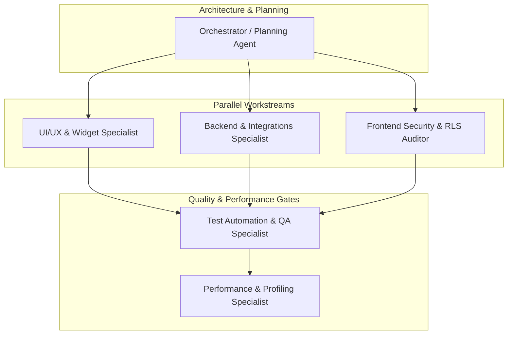

# Multiagent Task Breakdown & Execution Blueprint
**Project:** Pickleball Court Booking Mobile Application  
**Tech Stack:** Flutter (Dart 3) • Supabase (Postgres / Auth / Realtime / Edge Functions) • PayMongo (GCash / Maya / GrabPay / Cards) • Dynamic Calendar Links  

---

## 1. Executive Summary & Multiagent Operating Model

This document outlines the concrete, specialized tasks that autonomous multiagent systems (or specialized AI agent personas) can execute in parallel or sequentially within the **Pickleball App** codebase. 

By partitioning domain responsibilities—such as UI/UX components, backend data services, security hardening, automated testing, and performance profiling—multiple agents can work concurrently without merge conflicts or overlapping domain logic.

---

## 2. Agent Teams & Task Specifications

### Workstream 1: Interactive Visual Slot Grid & Dynamic Pricing
*Targeting Feature 2 from [`future.md`](file:///g:/Pickleball/future.md)*

- **Objective:** Replace static picker modal with an interactive visual court timeline and dynamic slot picker distinguishing peak hours from off-peak discounted hours with live pricing in Philippine Pesos (₱).
- **Target Files:**
  - Screen: [`lib/screens/booking/court_reservation.dart`](file:///g:/Pickleball/lib/screens/booking/court_reservation.dart)
  - Review Screen: [`lib/screens/booking/booking_review_screen.dart`](file:///g:/Pickleball/lib/screens/booking/booking_review_screen.dart)
  - Picker: [`lib/widgets/time_player_picker_modal.dart`](file:///g:/Pickleball/lib/widgets/time_player_picker_modal.dart)
  - Models: [`lib/models/court_model.dart`](file:///g:/Pickleball/lib/models/court_model.dart), [`lib/models/booking_model.dart`](file:///g:/Pickleball/lib/models/booking_model.dart)
  - Reference: [`referenceonly/project.sql`](file:///g:/Pickleball/referenceonly/project.sql)

#### Multiagent Task Breakdown:
1. **Agent A (UI/UX - Slot Selector Widget):**
   - Build a horizontal drag-and-scroll time slot bar with visual state indicators (Green: Available Off-Peak, Amber: Available Peak, Red/Grey: Booked/Held).
   - Support multi-slot tap selection for contiguous 30-minute / 1-hour intervals.
   - Display a floating dynamic price pill (e.g., `₱500/hr` vs `₱800/hr`).
2. **Agent B (Backend/Logic - Price Rules & Slot Lock Engine):**
   - Implement dynamic price calculation logic factoring in peak hour schedule rules and holiday multipliers.
   - Build a client-side 5-minute holding timer state machine to hold temporary locks before final confirmation.
3. **Agent C (Database Architect - Postgres Function):**
   - Author the Postgres advisory lock function `fn_hold_court_slot(p_court_id, p_start_time, p_end_time, p_user_id)` in SQL.

---

### Workstream 2: Smart QR Court Check-In & Realtime Subscriptions
*Targeting Feature 1 from [`future.md`](file:///g:/Pickleball/future.md)*

- **Objective:** Provide a dynamic, secure QR code check-in modal that auto-refreshes, works offline, and automatically transitions status in real-time when scanned at the court gate/kiosk.
- **Target Files:**
  - Modal: [`lib/widgets/check_in_qr_modal.dart`](file:///g:/Pickleball/lib/widgets/check_in_qr_modal.dart)
  - Service: [`lib/services/booking_service.dart`](file:///g:/Pickleball/lib/services/booking_service.dart)
  - Navigation/Card: [`lib/widgets/reservation_card.dart`](file:///g:/Pickleball/lib/widgets/reservation_card.dart)

#### Multiagent Task Breakdown:
1. **Agent A (UI/UX Specialist):**
   - Create the dynamic high-contrast QR display modal sheet.
   - Add real-time status badge with subtle pulsing animation (`Upcoming`, `Checked In`, `Session Active`, `Expired`).
   - Implement the live session countdown timer widget.
2. **Agent B (Realtime & State Specialist):**
   - Implement Supabase Realtime channel subscription listening to table update events (`supabase.from('bookings').stream()`).
   - Seamlessly switch UI state from "Tap to Check-In" to "Session Active" without requiring manual pull-to-refresh.
3. **Agent C (Offline Fallback & Security Specialist):**
   - Implement encrypted local caching of active booking tokens using `SharedPreferences` / secure storage for zero-connectivity venue access.
   - Add time-based rolling hash payload verification to prevent replay / screenshot sharing of static QR codes.

---

### Workstream 3: PayMongo Payment Gateway & Receipt Manager
*Targeting Feature 3 from [`future.md`](file:///g:/Pickleball/future.md)*

- **Objective:** Enable seamless in-app checkout using PayMongo (GCash, Maya, GrabPay, Credit/Debit) and generate itemized, downloadable PDF receipts.
- **Target Files:**
  - Screen: [`lib/screens/booking/booking_review_screen.dart`](file:///g:/Pickleball/lib/screens/booking/booking_review_screen.dart)
  - Modal: [`lib/widgets/downloadable_receipt_modal.dart`](file:///g:/Pickleball/lib/widgets/downloadable_receipt_modal.dart)
  - Modal: [`lib/widgets/booking_success_modal.dart`](file:///g:/Pickleball/lib/widgets/booking_success_modal.dart)
  - Models: [`lib/models/booking_model.dart`](file:///g:/Pickleball/lib/models/booking_model.dart)

#### Multiagent Task Breakdown:
1. **Agent A (Payment Integration Specialist):**
   - Integrate PayMongo API (`PaymentIntent` / `Checkout API`).
   - Handle checkout redirection, payment callback deep linking, and transaction state handling.
2. **Agent B (PDF & Document Generation Specialist):**
   - Design and build the branded itemized invoice layout (Court Fee, Peak Surcharges, VAT/Service fees, PayMongo transaction ID).
   - Integrate PDF rendering, local storage saving, and native device share sheet (iOS/Android).
3. **Agent C (Webhook & Storage Backend Specialist):**
   - Define Supabase Edge Function to process `payment.paid` webhooks and upload signed receipts to Supabase Storage bucket (`booking-receipts/`).

---

### Workstream 4: Security, RLS & Data Protection Hardening
*Leveraging `frontend-security-coder`*

- **Objective:** Perform security audits, harden input validation, safeguard API secrets, and verify database permissions.
- **Target Files:**
  - SQL Policies: [`referenceonly/project.sql`](file:///g:/Pickleball/referenceonly/project.sql)
  - Validation: [`lib/core/utils/validators.dart`](file:///g:/Pickleball/lib/core/utils/validators.dart)
  - Calendar Service: [`lib/services/calendar_link_service.dart`](file:///g:/Pickleball/lib/services/calendar_link_service.dart)
  - Auth Service: [`lib/services/auth_service.dart`](file:///g:/Pickleball/lib/services/auth_service.dart)

#### Multiagent Task Breakdown:
1. **Agent A (RLS & Database Security Auditor):**
   - Review and test Row Level Security (RLS) policies in Postgres to ensure players cannot query or mutate foreign booking records.
2. **Agent B (Input & URI Injection Specialist):**
   - Audit calendar deep-link generator in [`calendar_link_service.dart`](file:///g:/Pickleball/lib/services/calendar_link_service.dart) to prevent parameter injection or malicious URI schemes.
   - Harden form validation regexes in [`validators.dart`](file:///g:/Pickleball/lib/core/utils/validators.dart).
3. **Agent C (Auth & Session Security Specialist):**
   - Verify token refresh lifecycles, session timeouts, and prevent sensitive data logging in production release builds.

---

### Workstream 5: Comprehensive Automated Testing & QA Suite
*Leveraging `flutter-expert`*

- **Objective:** Achieve high test coverage across unit logic, widget rendering, and end-to-end booking flows.
- **Target Files:**
  - Test Suite: [`test/`](file:///g:/Pickleball/test/)
  - Unit Tests: [`test/validators_test.dart`](file:///g:/Pickleball/test/validators_test.dart), [`test/calendar_link_service_test.dart`](file:///g:/Pickleball/test/calendar_link_service_test.dart)
  - Widget Tests: [`test/widget_test.dart`](file:///g:/Pickleball/test/widget_test.dart), [`test/features_test.dart`](file:///g:/Pickleball/test/features_test.dart)

#### Multiagent Task Breakdown:
1. **Agent A (Unit & Service Mocking Specialist):**
   - Create mocktail / fake client test harnesses for Supabase Auth and Booking services.
   - Write unit tests for price calculation, slot holding timeout logic, and calendar link generation.
2. **Agent B (Widget & Interaction QA Specialist):**
   - Write widget tests for [`venue_picker_modal.dart`](file:///g:/Pickleball/lib/widgets/venue_picker_modal.dart), [`time_player_picker_modal.dart`](file:///g:/Pickleball/lib/widgets/time_player_picker_modal.dart), and [`custom_text_field.dart`](file:///g:/Pickleball/lib/widgets/custom_text_field.dart).
3. **Agent C (Golden Snapshot QA Specialist):**
   - Generate golden screenshot test fixtures for dark-themed neon buttons, cards, and modal sheets to catch UI regressions.

---

### Workstream 6: UI/UX Micro-Interactions & Performance Optimization
*Leveraging `ui-ux`, `ui-visual-validator`, and `application-performance-performance-optimization`*

- **Objective:** Deliver luxury dark-mode aesthetics, smooth 60/120 FPS transitions, and minimize memory overhead.
- **Target Files:**
  - Theme: [`lib/core/theme/app_theme.dart`](file:///g:/Pickleball/lib/core/theme/app_theme.dart)
  - Insights / Analytics: [`lib/screens/insights/insights.dart`](file:///g:/Pickleball/lib/screens/insights/insights.dart)
  - Navigation: [`lib/screens/home/main_navigation_screen.dart`](file:///g:/Pickleball/lib/screens/home/main_navigation_screen.dart)

#### Multiagent Task Breakdown:
1. **Agent A (Visual Polish & Animations Specialist):**
   - Add Hero animations between booking cards and review screens.
   - Introduce animated glassmorphism blur and shimmer skeleton placeholders during network loads.
2. **Agent B (Performance & Profiling Specialist):**
   - Wrap intensive charts in [`insights.dart`](file:///g:/Pickleball/lib/screens/insights/insights.dart) with `RepaintBoundary`.
   - Audit widget build counts and convert dynamic rebuilds into `const` constructors and localized `ValueListenableBuilder` nodes.

---

## 3. Multiagent Execution Matrix & Dependency Graph

| Priority | Task Area | Estimated Complexity | Prerequisites | Lead Agent Skill |
| :---: | :--- | :---: | :--- | :--- |
| **P1** | **Visual Slot Grid & Pricing Engine** | High | Existing Mock Data / Court Models | `flutter-expert`, `ui-ux` |
| **P1** | **PayMongo Checkout & Webhooks** | High | Booking Review Screen | `flutter-expert`, `backend` |
| **P2** | **Dynamic QR Pass & Realtime Sync** | Medium | Supabase Realtime Config | `flutter-expert`, `security` |
| **P2** | **Downloadable PDF Receipt Manager** | Medium | Completed Booking Models | `ui-ux`, `flutter-expert` |
| **P3** | **Widget & Golden Test Suite Expansion** | Medium | Core Screens Implemented | `flutter-expert`, `qa` |
| **P3** | **Security & RLS Hardening Audit** | Medium | Database Schema / Edge Functions | `frontend-security-coder` |
| **P4** | **Chart Repaint & Animation Profiling** | Low | Insights & Theme System | `application-performance` |

---

## 4. Multiagent Best Practices for This Repository

1. **Strict File Isolation:** Agents working concurrently must work in separated files or distinct layers (e.g., Agent 1 works in `lib/widgets/`, Agent 2 works in `lib/services/`, Agent 3 works in `test/`).
2. **Preserve Rules & Reference Files:** Do not mutate `referenceonly/` files (`layout.tsx`, `project.sql`, `booking.dart`). Treat them strictly as read-only architectural guidelines.
3. **Atomic Commits & Linting:** Run `npm run lint` or `flutter analyze` after each task stage to prevent cross-agent syntax or dependency regressions.
