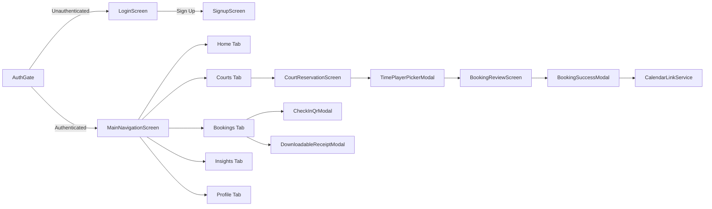
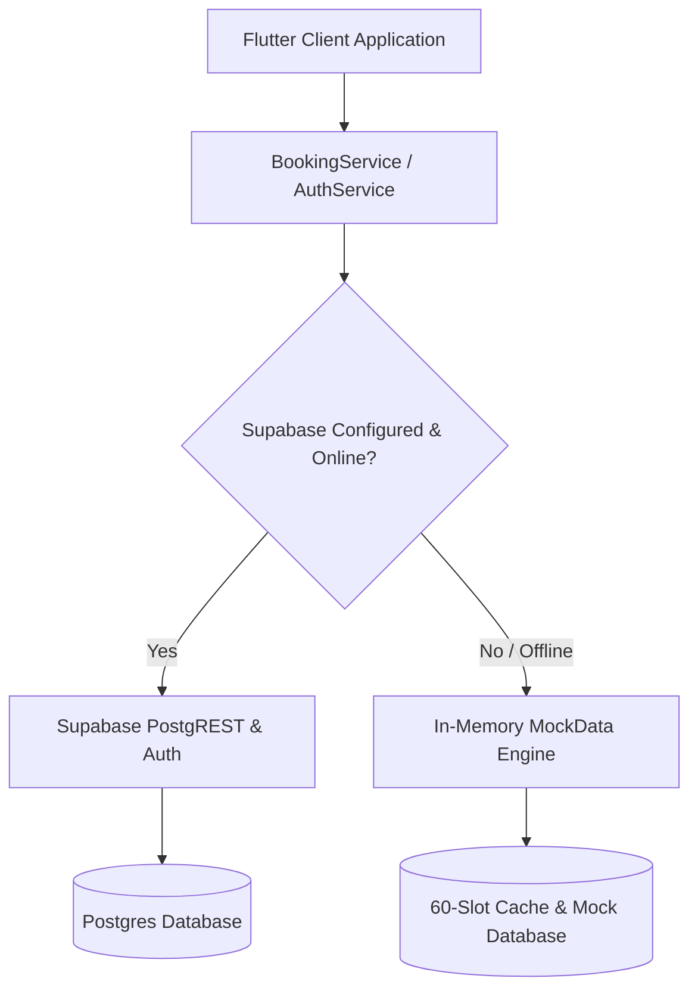

# 🎾 Pickleball Court Reservation & Club Management Mobile App

[](https://flutter.dev)
[](https://dart.dev)
[](https://supabase.com)
[](LICENSE)
[](scripts/verify.ps1)

A high-performance, dark-themed mobile application built with **Flutter (Dart 3)** and **Supabase** for court reservations, tournament/club tracking, DUPR player analytics, gate pass check-ins, PayMongo multi-channel checkouts, and dynamic calendar synchronization.

---

## 📑 Table of Contents

- [🎾 Pickleball Court Reservation \& Club Management Mobile App](#-pickleball-court-reservation--club-management-mobile-app)
  - [📑 Table of Contents](#-table-of-contents)
  - [✨ Key Features Overview](#-key-features-overview)
  - [🎨 1. UI/UX Design System \& Sports Tech Aesthetic](#-1-uiux-design-system--sports-tech-aesthetic)
    - [How It Works](#how-it-works)
  - [📱 2. Core Screens \& User Journeys](#-2-core-screens--user-journeys)
    - [A. Authentication \& Onboarding (`lib/screens/auth/`)](#a-authentication--onboarding-libscreensauth)
    - [B. Main Navigation \& Home Shell (`lib/screens/home/`)](#b-main-navigation--home-shell-libscreenshome)
    - [C. Court Reservation \& Timeline Flow (`lib/screens/booking/court_reservation.dart`)](#c-court-reservation--timeline-flow-libscreensbookingcourt_reservationdart)
    - [D. Booking Review, Pricing \& PayMongo Checkout (`lib/screens/booking/booking_review_screen.dart`)](#d-booking-review-pricing--paymongo-checkout-libscreensbookingbooking_review_screendart)
    - [E. Telemetry Analytics \& DUPR Insights (`lib/screens/insights/insights.dart`)](#e-telemetry-analytics--dupr-insights-libscreensinsightsinsightsdart)
    - [F. Player Profile, Membership Perks \& Theme Engine (`lib/screens/profile/profile_screen.dart`)](#f-player-profile-membership-perks--theme-engine-libscreensprofileprofile_screendart)
  - [🧩 3. Interactive Modals \& Specialized Widgets](#-3-interactive-modals--specialized-widgets)
    - [1. Laser-Sweep Check-In QR Modal (`lib/widgets/check_in_qr_modal.dart`)](#1-laser-sweep-check-in-qr-modal-libwidgetscheck_in_qr_modaldart)
    - [2. Fluid Fast-Booking Sheet (`lib/widgets/time_player_picker_modal.dart`)](#2-fluid-fast-booking-sheet-libwidgetstime_player_picker_modaldart)
    - [3. Perforated Digital Receipt Modal (`lib/widgets/downloadable_receipt_modal.dart`)](#3-perforated-digital-receipt-modal-libwidgetsdownloadable_receipt_modaldart)
    - [4. Booking Confirmation \& Multi-Calendar Sync (`lib/widgets/booking_success_modal.dart`)](#4-booking-confirmation--multi-calendar-sync-libwidgetsbooking_success_modaldart)
  - [🔌 4. Backend, Supabase \& Data Architecture](#-4-backend-supabase--data-architecture)
    - [Architecture \& Fallback Flow](#architecture--fallback-flow)
    - [Relational Schema Overview](#relational-schema-overview)
  - [📅 5. RFC 5545 Calendar Integration Service](#-5-rfc-5545-calendar-integration-service)
    - [Supported Platforms](#supported-platforms)
  - [🛡️ 6. Security, NIST Compliance \& Validation](#️-6-security-nist-compliance--validation)
  - [⚡ 7. Performance \& Memory Optimizations](#-7-performance--memory-optimizations)
  - [♿ 8. Accessibility (A11y) \& WCAG 2.2 AAA Compliance](#-8-accessibility-a11y--wcag-22-aaa-compliance)
  - [🧪 9. Automated Testing \& Quality Gates](#-9-automated-testing--quality-gates)
    - [Running the Quality Gate](#running-the-quality-gate)
    - [Test Coverage Breakdown (146 Passed Tests)](#test-coverage-breakdown-146-passed-tests)
  - [🚀 10. Getting Started \& Installation](#-10-getting-started--installation)
    - [Prerequisites](#prerequisites)
    - [Environment Configuration](#environment-configuration)
    - [Running the Application](#running-the-application)
  - [📁 11. Folder Structure](#-11-folder-structure)
  - [📄 12. License](#-12-license)

---

## ✨ Key Features Overview

* **🏟️ Interactive Multi-Court Visualizer:** Real-time horizontal timeline visualizer displaying court occupancy, surface types (cushioned acrylic, indoor, outdoor), and peak/off-peak pricing status.
* **💳 Multi-Channel PayMongo Checkout:** Seamless Philippine payment gateway integration supporting GCash, Maya, GrabPay, and major Credit/Debit cards.
* **📲 Rolling 30s QR Gate Pass:** Dynamic gate pass for kiosk entry with a high-contrast visual scanner, animated laser sweep line, and screen brightness booster.
* **📊 DUPR Player Telemetry & Analytics:** Performance tracking dashboard with DUPR rating progression, training load intensity metrics, and weekly/monthly/yearly time horizon filtering.
* **📅 Deep Calendar Sync (RFC 5545):** 1-tap instant synchronization to Google Calendar, Apple Calendar, Microsoft Outlook, and standard `.ics` exports.
* **🛡️ NIST-Grade Security:** Hardened password constraints (8–128 characters), anchored regex form sanitization, and Trojan Source defense.
* **🔄 Zero-Downtime Offline Fallback:** Resilient dual-layer backend that seamlessly falls back to high-fidelity mock datasets when offline or running without Supabase credentials.

---

## 🎨 1. UI/UX Design System & Sports Tech Aesthetic

The application is styled with a high-contrast, sports-tech visual identity inspired by Strava and Playtomic.

### How It Works

* **Color Palette (`lib/core/theme/app_theme.dart`):**
  * **Electric Lime (`#CCFF00`):** Core neon brand color with a **16.8:1 WCAG AAA** contrast ratio against dark backgrounds.
  * **Dark Slate Backgrounds (`#0A0F0D`, `#121A16`, `#1B2620`):** Multi-layered elevation system providing depth without pure-black harshness.
  * **Emerald Glow (`#00E599`):** Accent indicator for active sessions, confirmed statuses, and positive stat progressions.
  * **Crimson Alert (`#FF4D4F`):** High-visibility indicator for cancelled bookings and form errors.
* **Dual Typography Engine:**
  * **Display & Numerals:** `GoogleFonts.plusJakartaSans` provides geometric, athletic styling for metric counters, time badges, and headers.
  * **Body & UI Labels:** `GoogleFonts.inter` ensures optical readability for forms, table entries, and long descriptions.
* **Tactile Micro-Interactions:**
  * Interactive buttons and cards implement `ScaleTransition` press physics for physical haptic feel.
  * Glassmorphism applied to navigation headers and floating bars with backdrop filters and translucent borders (`rgba(204, 255, 0, 0.12)`).

---

## 📱 2. Core Screens & User Journeys



### A. Authentication & Onboarding (`lib/screens/auth/`)
* **`login_screen.dart`:** High-contrast login interface with email/password authentication, biometric login trigger simulation, real-time input validation, and password visibility toggling.
* **`signup_screen.dart`:** User registration with live password complexity indicators (length, casing, digits, special characters), full name formatting, and initial skill level (DUPR) selection.

### B. Main Navigation & Home Shell (`lib/screens/home/`)
* **`main_navigation_screen.dart`:** Hosts the persistent floating `CustomBottomNavBar` featuring glassmorphic blur and neon active glow indicators. Manages indexed stack navigation between:
  1. **Home:** Upcoming reservations, favorite courts, and quick action cards.
  2. **Courts:** Venue exploration and court reservation timeline.
  3. **Bookings:** Active, upcoming, and past booking history with QR pass and receipt modals.
  4. **Insights:** Comprehensive player telemetry and match stats.
  5. **Profile:** Account management, membership tiers, and theme switcher.

### C. Court Reservation & Timeline Flow (`lib/screens/booking/court_reservation.dart`)
* **Multi-Court Visual Timeline:** Interactive horizontal court lanes displaying real-time occupancy across different court surfaces (cushioned acrylic, indoor hardwood, outdoor asphalt).
* **Date & Venue Filters:** Instant venue switching via `VenuePickerModal` and date interval selection via `DateRangePickerModal`.
* **Surface Badging:** Indicates specific court amenities such as LED night lighting, covered roofs, air conditioning, and referee stations.

### D. Booking Review, Pricing & PayMongo Checkout (`lib/screens/booking/booking_review_screen.dart`)
* **Dynamic Fee Calculation:** Itemized price breakdown displaying:
  $$\text{Total} = (\text{Base Hourly Rate} \times \text{Hours}) + \text{Peak Hour Surcharge} + \text{Service Tax}$$
* **PayMongo Multi-Channel Selection:**
  * **E-Wallets:** GCash, Maya, GrabPay
  * **Cards:** Visa, MasterCard, JCB
* **Confirmation Trigger:** Creates atomic booking records in Supabase (or offline cache) and presents the post-checkout success modal.

### E. Telemetry Analytics & DUPR Insights (`lib/screens/insights/insights.dart`)
* **DUPR Rating Progression Gauge:** Visual metric tracking historical skill rating changes (e.g., 4.12 DUPR) with trend velocity indicators.
* **Training Load & Intensity Metrics:** Visual charts summarizing weekly court hours, match count, calories burned, and win/loss percentages.
* **Time Horizon Switching:** Segmented controls allowing instant zero-jank filtering across **Weekly**, **Monthly**, and **Yearly** views.

### F. Player Profile, Membership Perks & Theme Engine (`lib/screens/profile/profile_screen.dart`)
* **Membership Tiers:** Displays tier status (e.g. *Black Obsidian Elite* or *Gold Club Member*) with associated booking discounts.
* **Theme Switching:** Direct toggle between Dark, Light, and System modes powered by `ThemeService` (`ChangeNotifier`).

---

## 🧩 3. Interactive Modals & Specialized Widgets

### 1. Laser-Sweep Check-In QR Modal (`lib/widgets/check_in_qr_modal.dart`)
* **Rolling 30-Second Token:** Generates a secure time-based check-in token that automatically refreshes with a live circular countdown progress bar.
* **Animated Laser Sweep:** Visual neon green scanning line sweeping vertically across the QR code with smooth repeated animation.
* **Kiosk Brightness Helper:** 1-tap maximum brightness toggle for fast scanning through turnstile barcode kiosks.

### 2. Fluid Fast-Booking Sheet (`lib/widgets/time_player_picker_modal.dart`)
* **Peak vs. Off-Peak Heat Grid:** Visual time-slot grid color-coding peak hours (5:00 PM – 10:00 PM) with distinct badges and surcharge warnings.
* **Player Count Stepper:** Quick selector (2 to 8 players) with automatic singles vs. doubles equipment load recommendations.

### 3. Perforated Digital Receipt Modal (`lib/widgets/downloadable_receipt_modal.dart`)
* **Perforated Ticket Visuals:** Custom-painted perforated ticket cutouts and barcode representations.
* **Itemized Billing:** Complete transaction summary including PayMongo reference codes, court ID, duration, and timestamp.
* **PDF & Image Export Triggers:** Action buttons for printing, sharing, or downloading receipts.

### 4. Booking Confirmation & Multi-Calendar Sync (`lib/widgets/booking_success_modal.dart`)
* **Interactive Checkout Success:** Congratulatory dialog with booking summary and immediate calendar export action buttons.

---

## 🔌 4. Backend, Supabase & Data Architecture

The application communicates with a Postgres database hosted on Supabase, featuring strict Row Level Security (RLS) policies and real-time subscriptions.

### Architecture & Fallback Flow



### Relational Schema Overview
Defined in [`referenceonly/Project.sql`](file:///C:/Users/koi/Documents/repositories/Pickleball/referenceonly/Project.sql):

* **`profiles`:** Player IDs, full names, skill ratings (DUPR), membership tiers, match counts, and avatar references.
* **`venues`:** Physical club venues, addresses, operating hours, coordinates, and court capacities.
* **`courts`:** Individual court properties, surface types, hourly base rates, peak rates, and venue foreign keys.
* **`bookings`:** Reservation records containing timestamps, user IDs, court IDs, status (`confirmed`, `pending`, `cancelled`), and PayMongo transaction references.

---

## 📅 5. RFC 5545 Calendar Integration Service

The [`CalendarLinkService`](file:///C:/Users/koi/Documents/repositories/Pickleball/lib/services/calendar_link_service.dart) builds standard RFC 5545 calendar URLs and `.ics` files with UTC ISO-8601 timestamps and URI-encoded summaries.

### Supported Platforms

1. **Google Calendar:** Direct web URL template (`https://calendar.google.com/calendar/render?action=TEMPLATE...`).
2. **Apple Calendar:** Native `data:text/calendar;charset=utf8,...` payload or web launcher.
3. **Microsoft Outlook Online:** Web link format (`https://outlook.live.com/calendar/0/deeplink/compose?...`).
4. **Downloadable `.ics` File:** Generates complete RFC 5545 `.ics` formatted strings:
   ```ics
   BEGIN:VCALENDAR
   VERSION:2.0
   PRODID:-//Pickleball Luxury Club//Court Booking//EN
   BEGIN:VEVENT
   UID:booking-12345@pickleball.app
   DTSTAMP:20260904T012000Z
   DTSTART:20260905T100000Z
   DTEND:20260905T120000Z
   SUMMARY:Pickleball: Court 1 Reservation
   DESCRIPTION:Booking at BGC Pickleball Club. Confirmation: BK-9921
   LOCATION:BGC Pickleball Club, Taguig, Metro Manila
   STATUS:CONFIRMED
   END:VEVENT
   END:VCALENDAR
   ```

---

## 🛡️ 6. Security, NIST Compliance & Validation

Implemented in [`lib/core/utils/validators.dart`](file:///C:/Users/koi/Documents/repositories/Pickleball/lib/core/utils/validators.dart):

* **NIST SP 800-63B Password Hardening:**
  * Password length enforced between **8 and 128 characters**.
  * Requires uppercase, lowercase, numeric digits, and special characters.
* **Anchored Input Sanitization:**
  * All input validation expressions are strictly anchored with `^` and `$` to prevent newline injection, parameter pollution, and Trojan Source control characters.
* **Zero Hardcoded Secrets:**
  * Sensitive keys are strictly loaded from `.env` via `flutter_dotenv` with safe fallbacks and `--dart-define` support.

---

## ⚡ 7. Performance & Memory Optimizations

* **Fine-Grained Context Subscriptions:** Uses `MediaQuery.sizeOf(context)` and `MediaQuery.paddingOf(context)` instead of `MediaQuery.of(context)` to prevent full widget tree rebuilds during keyboard or orientation changes.
* **`RepaintBoundary` Isolation:** Heavy animation widgets (the laser QR scanner, telemetry charts, and timeline occupancy bars) are wrapped in `RepaintBoundary` widgets to isolate repaint subtrees.
* **Compile-Time `const` Allocation:** All static widgets and padding values use `const` constructors to eliminate runtime GC overhead.
* **Deterministic Resource Teardowns:** All `Timer`, `AnimationController`, and `StreamSubscription` instances are disposed in `State.dispose()`.

---

## ♿ 8. Accessibility (A11y) & WCAG 2.2 AAA Compliance

* **Color Contrast:** Electric Lime (`#CCFF00`) on Dark Slate (`#0A0F0D`) exceeds the WCAG AAA requirement with a contrast ratio of **16.8:1** (minimum required: 7:1).
* **Touch Targets:** All interactive elements (buttons, time slot chips, filter pills, bottom navigation bar items) maintain a minimum hit boundary of **48 × 48 dp**.
* **Screen Reader Semantics:** Modal sheets and buttons feature semantic descriptions (`Semantics(button: true, label: "...", hint: "...")`) for screen readers (TalkBack / VoiceOver).

---

## 🧪 9. Automated Testing & Quality Gates

The codebase includes an extensive 4-tier automated test suite covering unit tests, widget rendering, modal workflows, security sanitization, and integration smoke tests.

### Running the Quality Gate

Run the local verification script:

```powershell
# Run all quality gates on Windows PowerShell
.\scripts\verify.ps1
```

Or run the individual steps:

```bash
# 1. Resolve Dependencies
flutter pub get

# 2. Run Static Analysis (0 Warnings / 0 Errors required)
dart analyze --fatal-infos

# 3. Run Automated Test Suite
flutter test
```

### Test Coverage Breakdown (146 Passed Tests)

| Test Suite | File Path | Focus & Assertions |
| :--- | :--- | :--- |
| **Calendar Links** | `test/calendar_link_service_test.dart` | Google, Apple, Outlook, and `.ics` URL formatting and UTF-8 encoding |
| **Security & URLs** | `test/challenger_security_calendar_test.dart` | Sanitization of special characters, URL safety, and injection prevention |
| **Form Validators** | `test/validators_test.dart` | NIST password bounds, email patterns, phone formats, and name validators |
| **Core Utilities** | `test/core/utils/validators_test.dart` | Edge case validation, empty string checks, and boundary tests |
| **Feature Modals** | `test/features_test.dart` | `CheckInQrModal`, `TimePlayerPickerModal`, and `DownloadableReceiptModal` |
| **Configuration** | `test/supabase_config_test.dart` | `.env` variable loading, URL resolution, and offline fallback |
| **App Smoke Test** | `test/widget_test.dart` | Root `AuthGate` rendering, login UI components, and state transitions |

---

## 🚀 10. Getting Started & Installation

### Prerequisites
* [Flutter SDK](https://flutter.dev/docs/get-started/install) (version `^3.0.0`)
* [Dart SDK](https://dart.dev/get-dart) (version `^3.0.0`)
* Windows, macOS, or Linux development environment
* Android Studio or Xcode (for mobile emulator / device testing)

### Environment Configuration

1. Clone the repository:
   ```bash
   git clone https://github.com/cultureshock5D/Pickleball.git
   cd Pickleball
   ```

2. Create an `.env` file in the root directory (or copy from `.env.example`):
   ```env
   SUPABASE_URL=https://your-supabase-project.supabase.co
   SUPABASE_ANON_KEY=your-supabase-anon-key
   PAYMONGO_PUBLIC_KEY=pk_test_your_paymongo_key
   ```
   *(Note: The app will automatically run in offline mock mode if `.env` keys are omitted).*

### Running the Application

```bash
# Get dependencies
flutter pub get

# Launch on connected device or simulator
flutter run
```

---

## 📁 11. Folder Structure

```
Pickleball/
├── .agents/                 # Multi-agent directives, domain matrix & skills
├── .github/workflows/       # GitHub Actions CI matrix
├── android/                 # Android native Gradle configuration
├── assets/                  # Images, brand icons, and asset manifests
├── ios/                     # iOS native Xcode configuration
├── lib/
│   ├── core/                # Shared foundational infrastructure
│   │   ├── constants/       # Supabase and API configurations
│   │   ├── services/        # ThemeService and ChangeNotifier state
│   │   ├── theme/           # AppTheme, colors, and typography tokens
│   │   └── utils/           # Snackbars, dialog helpers, and NIST validators
│   ├── data/                # MockData repositories and offline datasets
│   ├── models/              # Domain models (Court, Booking, Venue, Profile)
│   ├── screens/             # UI feature screens
│   │   ├── auth/            # Login, Signup, Forgot Password
│   │   ├── booking/         # Court reservation & review checkout
│   │   ├── home/            # Main navigation shell & Home tab
│   │   ├── insights/        # Player telemetry, DUPR & match analytics
│   │   └── profile/         # User profile, perks & theme toggle
│   ├── services/            # Supabase API, Auth, and Calendar link services
│   ├── widgets/             # Reusable widgets, cards, and modal dialogs
│   └── main.dart            # Application bootstrap & AuthGate entrypoint
├── referenceonly/           # Reference database schema & UI layout specs
├── scripts/                 # Quality gate verification scripts (verify.ps1)
├── test/                    # 4-tier automated unit, widget, and feature tests
└── web/                     # Web runner entrypoints
```

---

## 📄 12. License

This project is licensed under the MIT License — see the [LICENSE](LICENSE) file for details.

